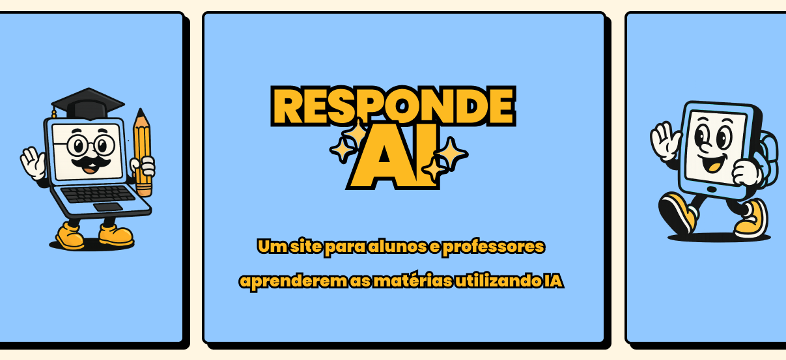

# Responde AI

Uma aplicação que visa ajudar professores a engajar seus alunos através de quizzes criados e personalizados utilizando IA.

## Home do site

Nesta tela temos as opções de perfis disponíveis na plataforma

## Telas do Responde AI

A seguir estão as telas disponíveis no site:

### Home do professor
Dentro da home do professor estão disponíveis as páginas de:

- Criar Quiz
- Turmas e alunos 
- Perfil

### Home do aluno

Dentro da home do aluno estão disponíveis as páginas de:

- Quizzes;
  - Página do quiz escolhido
- Perfil;

## Back-end

Os serviços que foram utilizados para o back-end estão disponíveis nos links:

**Serviço de usuários:** https://github.com/andORibeiro/respondeai-user-service

**Serviço de quizzes:** https://github.com/andORibeiro/respondeai-quiz-service

------

Projeto desenvolvido para a Hackathon da Pós-Tech em Fullstack Development da FIAP